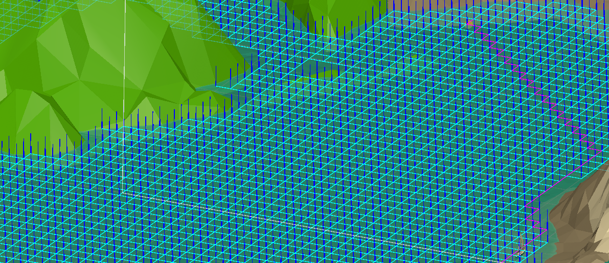

# First Unity Game



A simple Unity game where players control a sailboat with the goal of collecting 3 coins scattered across the map. The game also features an option for an AI-controlled player.

## Features

- **Button Mapping:** Change the buttons to control play.
- **AI Player:** Option to play with an AI-controlled sailboat.
- **Grid Generator:** Generates a grid exclusively on water terrain.
- **A* Pathfinding:** Uses an A* algorithm to find the shortest path.
- **Particle Manager:** Manages particle effects to enhance visual appeal.

## Installation

1. **Clone the repository:**
   ```bash
   git clone https://github.com/matchret/Sail-Game.git
   
2. **Open in Unity:** Open the cloned project in Unity.

3. **Run the Game:** Build and run the game from within Unity.
   
## How to Play
**Objective:** Collect all 3 coins on the map.
**Controls:** Use your preferred input device (keyboard/mouse or controller) to navigate your sailboat.
**Button Mapping:** Customize controls as needed.

## Authors
Mathieu Chrétien
Vincent Cousineau
